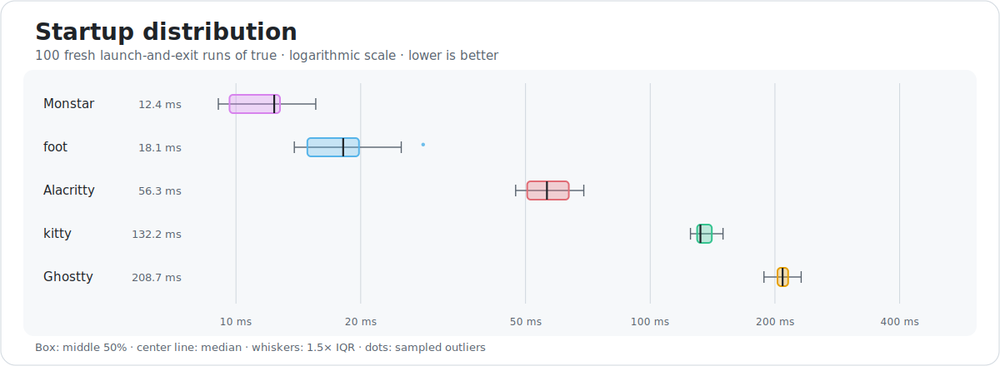
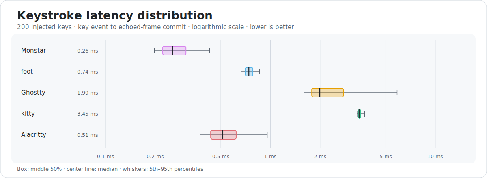
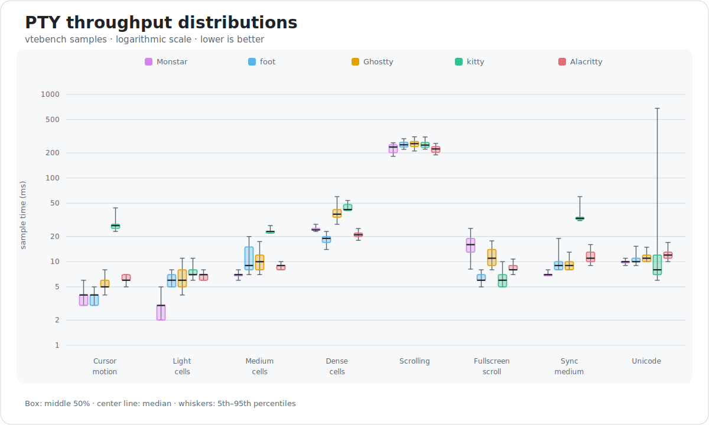

<h1 align="center">
  <picture>
    <source media="(prefers-color-scheme: dark)" srcset="./dist/dev.rockorager.monstar-wordmark.svg">
    <source media="(prefers-color-scheme: light)" srcset="./dist/dev.rockorager.monstar-wordmark-light.svg">
    
  </picture>
</h1>

Monstar is a terminal emulator for Linux and Wayland.

## Features

- Wayland windows, fractional scaling, text input (IME), clipboard, primary
  selection, activation, and system bell support.
- Desktop notifications and launcher progress over D-Bus.
- Link and file opening through XDG desktop portals.
- Optional systemd scopes for shell processes.
- Kitty graphics, OSC 8 hyperlinks, URI detection, synchronized output, and
  terminal color support.
- Scrollback search while terminal output continues.
- Fontconfig fonts, bundled color schemes, desktop light/dark preference,
  padding, and background opacity settings.
- Touchpad scrolling, separate precision and discrete wheel settings,
  rectangular selection, and link opening.
- Configuration reloads for most appearance and interaction settings.

## Performance

Reference distributions recorded on an Intel Core Ultra 7 258V. Lower is
better. Results vary by workload.

### Startup

Launch-and-exit time over 100 fresh runs of `true`:

<picture>
  <source media="(prefers-color-scheme: dark)" srcset="./dist/benchmark-startup.svg">
  <source media="(prefers-color-scheme: light)" srcset="./dist/benchmark-startup-light.svg">
  
</picture>

### Keystroke latency

Key event to echoed-frame commit over 200 injected keys:

<picture>
  <source media="(prefers-color-scheme: dark)" srcset="./dist/benchmark-latency.svg">
  <source media="(prefers-color-scheme: light)" srcset="./dist/benchmark-latency-light.svg">
  
</picture>

### PTY throughput

Sample-time distributions from eight vtebench workloads:

<picture>
  <source media="(prefers-color-scheme: dark)" srcset="./dist/benchmark-vtebench.svg">
  <source media="(prefers-color-scheme: light)" srcset="./dist/benchmark-vtebench-light.svg">
  
</picture>

vtebench measures producer blocking and PTY read throughput, not frame
presentation or input latency.

<details>
<summary>Benchmark methodology</summary>

- Date: July 15, 2026.
- Session: hardware-accelerated, headless Sway 1.12 at 2560×1440.
- Renderer: GLES2 on the Intel GPU through `/dev/dri/renderD128`.
- Process setup: empty configuration and a fresh process for each terminal.
- Startup: measured with hyperfine 1.20.0 after 10 warmups. Commands were
  `monstar -e true`, `foot true`, `ghostty -e true`, `kitty true`, and
  `alacritty -e true`. The result covers the complete process lifetime, not
  time to the first visible frame.
- Keystroke latency: measured in 120×40 terminals under
  `WAYLAND_DEBUG=client`. The test injected 200 keys with `wtype` at intervals
  from 50 to 100 ms. A marked 20 ms raw-PTY echo delay was subtracted from each
  sample to separate output commits from toolkit-only redraws. The result
  includes client key handling, the PTY round trip, rendering, and buffer
  commit. It excludes physical input, compositor presentation, and display
  latency.
- PTY throughput: measured with the default
  [vtebench](https://github.com/alacritty/vtebench) suite at 120×40 cells. The
  test used the standard 1 MiB minimum sample size and 10-second workload
  limit. The result covers PTY reads, not frame rate, display latency, or
  final-frame presentation.
- Versions: Monstar 0.1.0 (`5b350e2`, `ReleaseFast`), foot 1.27.0,
  Ghostty 1.3.2 tip (`c5a21ed`), kitty 0.47.4, and Alacritty 0.17.0.

</details>

## Linux integration

- XDG desktop portals open links, local files, and directories. Portal
  settings provide the desktop light/dark preference. Link opening uses
  Wayland activation tokens.
- D-Bus session services provide desktop notifications and launcher progress.
  Notification actions can activate the terminal window.
- Monstar launches new windows opened with `Ctrl+Shift+N` through the systemd
  user manager. Optional transient scopes place each shell process tree in a
  separate scope.
- Wayland protocols provide fractional scaling, text-input-v3 IME, cursor
  shapes, clipboard and primary selection, server-side decorations, named app
  icons, activation, system bell, and translucent background blur support.

Enable a transient systemd scope for each newly spawned shell with:

```conf
linux-cgroup = always
```

If the session bus or systemd scope is unavailable, Monstar leaves the shell
in its inherited cgroup. Link opening falls back to `xdg-open` when the portal
is unavailable. Monstar disables optional Wayland protocols when the
compositor does not support them.

D-Bus is a build-time dependency of the default build (`libdbus-1` headers
and library). Pass `-Ddbus=false` to drop it entirely, at the cost of desktop
notifications, launcher progress, portal-based link/file opening (falls back
to `xdg-open`), portal light/dark detection, and systemd cgroup isolation.
Nothing else is affected. `systemd` itself is never a build dependency; it is
only used at runtime, over the session bus, when `linux-cgroup = always` is
configured and a systemd user session is detected.

## Install

Install the current development version on Arch Linux from the
[`monstar-git` AUR package](https://aur.archlinux.org/packages/monstar-git):

```sh
yay -S monstar-git
```

Build and install Monstar from source into `~/.local`:

```sh
zig build -Doptimize=ReleaseFast install --prefix "$HOME/.local"
```

The command installs the executable, desktop entry, app icon, manual pages,
and bundled themes. Add `$HOME/.local/bin` to `PATH`, then launch Monstar:

```sh
monstar
```

See [Development](#development) for build requirements.

## Usage

Run Monstar without arguments to start `$SHELL`. Monstar falls back to
`/bin/sh` when `SHELL` is unset. Pass `-e` to run a command directly:

```sh
monstar -e fish --login
```

Pass `--` to run a shell expression:

```sh
monstar -- 'git log --oneline | less'
```

Set the working directory, initial size, title, app ID, font, and one-off
configuration overrides with command-line options:

```sh
monstar --working-directory ~/src \
  --title scratch \
  --window-size-chars 100x32 \
  --font Iosevka \
  -o background-opacity=0.95
```

Run `monstar --help`, `man monstar`, or `man 5 monstar` for the complete
command and configuration reference.

## Configuration

Write configuration to `$XDG_CONFIG_HOME/monstar/config`. Use
`~/.config/monstar/config` when `XDG_CONFIG_HOME` is unset. Start with:

```conf
font-family = Iosevka
font-size = 12.5
theme = light:Rose Pine Dawn,dark:Rose Pine
background-opacity = 0.95
window-padding-x = 8
window-padding-y = 6
mouse-scroll-multiplier = precision:1,discrete:3
```

By default, `background-opacity` affects only the default terminal background
and padding. Set `background-opacity-cells = true` to apply it to explicit cell
background colors too. Monstar requests compositor-provided blur whenever the
background is translucent; set `background-blur = false` to keep it clear.

Leave `theme` unset to follow the desktop light/dark preference. Load bundled
iTerm2 color schemes by name. Put custom themes in
`$XDG_CONFIG_HOME/monstar/themes` or `~/.config/monstar/themes`.

Set the default command for new windows. Commands run through `/bin/sh -c`
unless prefixed with `direct:`:

```conf
command = fish --login
# command = direct:fish --no-config
```

Press `Ctrl+Shift+,` or send `SIGUSR1` to reload the configuration:

```sh
pkill -USR1 monstar
```

Visual and interaction settings apply immediately. Process and storage
settings apply to new windows.

## Keybindings

| Shortcut | Action |
| --- | --- |
| `Ctrl+Shift+C` / `Ctrl+Shift+V` | Copy / paste |
| `Ctrl+Shift+F` | Search scrollback |
| `Ctrl+Shift+N` | Open a new window in the current directory |
| `Ctrl+Shift+,` | Reload configuration |
| `Ctrl++` / `Ctrl+=` / `Ctrl+-` | Adjust the font size |
| `Ctrl+0` | Reset the font size |
| `Ctrl` + left click | Open a hyperlink or detected URI |
| `Ctrl` + drag | Make a rectangular selection |

Scrollback search updates as you type. Press `Ctrl+N` and `Ctrl+P` to move
between matches. Press `Enter` to copy a match to the primary selection. Press
`Escape` to restore the previous viewport.

Hold `Shift` while dragging to select text after an application captures the
mouse. Hold `Ctrl+Shift` instead of `Ctrl` to open a link in this state.
Middle-click to paste the primary selection.

## Development

Building requires Zig 0.16, the Wayland 1.25 core schema,
wayland-protocols 1.49, and development libraries for Wayland, Fontconfig,
FreeType, HarfBuzz, xkbcommon, and D-Bus. Monstar negotiates protocol versions
at runtime to support older compositors.

```sh
zig build
zig build test
zig build fmt
```
